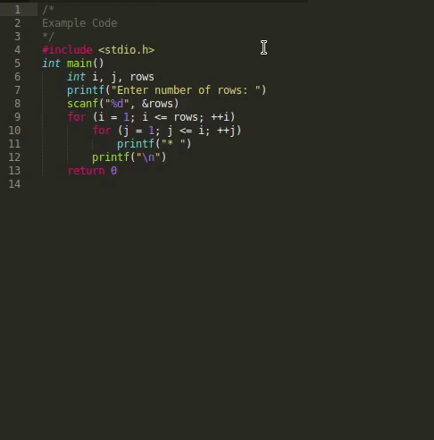

# Indenter
This is a Code preprocessing tool, written in Python, which allows you to write Code without semicolons and curly brackets i.e. Python like indentation.

### New Sublime Text Package




[Download Here](https://packagecontrol.io/packages/Indentor)


### Steps
- Write the Code it any language without using brackets or semicolans use indentions to show code blocks
- Run the code through Indenter Script
- Enjoy


### Supported Languages :
- C
- C++
- C#
- Java
- Go-Lang
- Java-Script
- PHP
- and many more...


## Usage
Run the code through Indenter before executing or compiling it.
In Terminal / Command Prompt
```
$ python indent.py [general commands] 
```

eg: ``` $ python indent.py cc eg.c -o eg.out```
Also See Examples given below

**example.c Contains:**
```
#include <stdio.h>
int main()
	int i, j, rows
	printf("Enter number of rows: ")
	scanf("%d", &rows)
	for (i = 1; i <= rows; ++i)
		for (j = 1; j <= i; ++j)
			printf("* ")
		printf("\n")
	return 0
```
Notice how the above code has no line-ending ";" or "{}"

#### - To get Output in a Different File
In Terminal :```$ python indent.py --output2file outfile.c example.c```

**[License](LICENSE)**

Inspired by [JavaPy](https://github.com/raptor4694/JavaPy)

```This Dependency might have bugs.```
